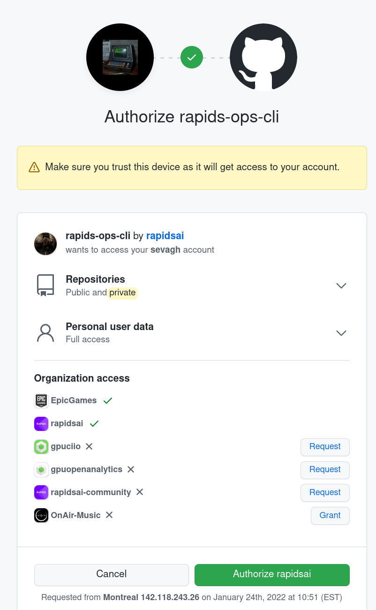

# roc
## rapids-ops-cli

`roc` (rapids-ops-cli) is a command-line tool for the RAPIDS Ops team to add a bit of automation and convenience to routine manual tasks related to the [RAPIDSAI GitHub org](https://github.com/rapidsai/).

The subcommands that are currently implemented are:
* prcommitmsg: Formats a commit message according to the style set in the [ops-bot](https://github.com/rapidsai/ops-bot) AutoMerger

  Example usage:
  ```
  $ roc prcommitmsg cudf 10008
  This PR replaces custom CUDA bindings that are provided by RMM, with official CUDA Python bindings. This PR should be merged after the RMM PR  https://github.com/rapidsai/rmm/pull/930
  
  Authors:
     - Ashwin Srinath (https://github.com/shwina)
  
  Approvers:
     - Jordan Jacobelli (https://github.com/Ethyling)
     - Vyas Ramasubramani (https://github.com/vyasr)
  ```

### Authentication with GitHub

This tool authentications with an Oauth flow similar to [`gh`](https://github.com/cli/cli) and [`r3`](https://github.com/adjschmidt8/r3). When using the tool for the first time, it will launch your browser and make you follow an interactive authentication procedure:



### Code structure

The code is structured like a typical modern Go project:
```
├── cmd
│   └── roc
│       ├── formatPRCommitMessage.go
│       └── main.go
├── internal
│   ├── build
│   │   └── build.go
│   └── ghcli
│       └── ghcli.go
└── pkg
    └── github
        ├── commitmessage.go
        ├── commitmessage_test.go
        └── github.go
```

The project uses [Cobra](https://github.com/spf13/cobra) and [Viper](https://github.com/spf13/viper), popular Go cli libraries, and the initial code and code structure was cribbed from [r3](https://github.com/ajschmidt8/r3) and [rvc](https://github.com/rapidsai/rvc).

#### Commands

`cmd` contains the command-line tool `roc`. If it makes sense to house different cli tools within this code base, they can be added as new directories under `cmd`.

#### Internal helper libraries

`internal` contains some internal utilities that shouldn't be consumed by outside users, e.g. build-time variables for exposing the version and build time.

#### External helper libraries

`pkg` contains parts of `rapids-ops-cli` that may be useful for consumption by outside users. For example, the `github` package consists of some utilities for creating an authenticated [go-github Client](https://pkg.go.dev/github.com/google/go-github/v42/github#Client) and the PR commit message formatting code, which was originally copied from ops-bot and may be useful in other places.

### TODOs

This project is fresh and needs the following:
* Proper versioning using git tags or some other mechanism (after the first commit merge)
* CI/CD and releases uploaded somewhere (S3? GitHub releases?) to be easily downloaded by RAPIDS Ops
* Compilation for OSX and/or Windows (depending on how confident we are that RAPIDS Ops uses primarily Linux, this may be less important)
